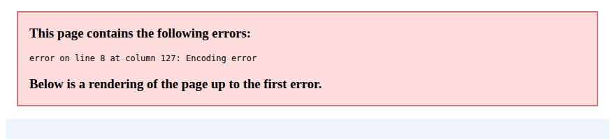
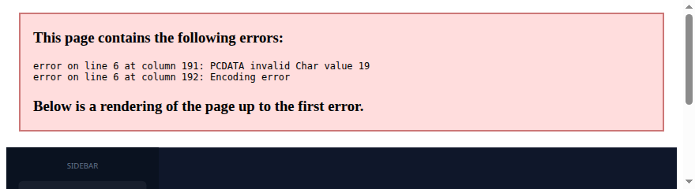
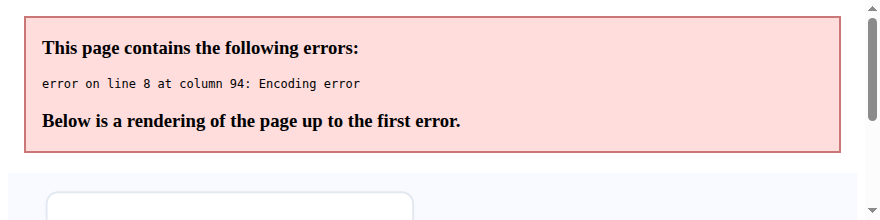
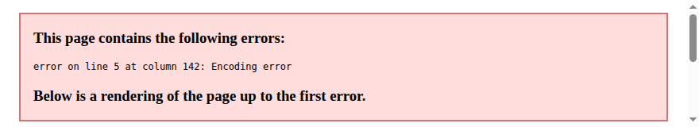

# دليل استعمال لوحات تحكم رزق — Dashboard Guide

**RIZQ Platform · ADMINIA SARL**

## نظرة عامة

هذا الدليل يشرح استعمال لوحات المشتركين (أفراد / محل / مكتب / شركة) ولوحة Super Admin.

> **📘 النسخة المرئية الكاملة:** افتح [`rizq_help.html`](../../rizq_help.html) — 4 صور توضيحية (PNG/SVG) بالعربية والفرنسية.

## 1. خريطة المنصة — مسار البائع



1. **الرئيسية** (rizq.mr) → **تسجيل** حساب بائع
2. **مراجعة** Super Admin (موافقة)
3. **لوحة التحكم** → نشر منتجات/إعلانات
4. **صفحة عامة** Store / Office / Corp للزوار

## 2. لوحة Super Admin — أين تظهر الحسابات الجديدة؟



- تبويب **«الحسابات»** = طلبات جديدة (pending) — **هنا** يظهر التسجيل الجديد.
- تبويب **«المستخدمون»** = معتمدون فقط (approved).
- تأكد أن رابط الخادم = `RIZQ_BACKEND_BASE` (يُضبط تلقائياً بعد تسجيل دخول الأدمن).

## 3. الفيديو التعريفي (Promo Video)



- **نعم** — يمكن إضافة **رابط** فيديو (YouTube أو Facebook) من تبويب الملف الشخصي.
- الحقل: `promo_video` / «فيديو تعريفي».
- يُحفظ محلياً **و** يُزامَن مع الخادم عبر `PATCH /api/accounts/mine/:id`.
- يظهر للزوار في صفحتك العامة (`rizq_store.html`, `rizq_office.html`, `rizq_corp.html`).
- **ملاحظة:** الرفع الحالي برابط فقط (ليس رفع ملف فيديو مباشر على الخادم).

### خطوات ضبط الفيديو
1. افتح لوحة التحكم → الملف الشخصي / Profile.
2. الصق رابط YouTube أو Facebook في حقل «فيديو تعريفي».
3. اضغط «حفظ التغييرات».
4. افتح صفحتك العامة للتحقق.

## 4. أنواع لوحات التحكم



| النوع | الصفحة |
|-------|--------|
| 👤 أفراد | `dashboard.html` |
| 🏪 محل / معرض | `dashboard_store.html` |
| 🏢 مكتب | `dashboard_office.html` |
| 🏭 شركة | `dashboard_corp.html` |

## 5. تنزيل هذا الدليل

```
GET /api/help-guide/dashboard-guide
GET /api/help-guide/help-visual?inline=1
GET /api/help-guide/platform-manual
```

الصور التوضيحية: `/help-images/fig1-journey.png` … `fig4-dashboard-types.png`

---

*آخر تحديث: سبتمبر 2026*
