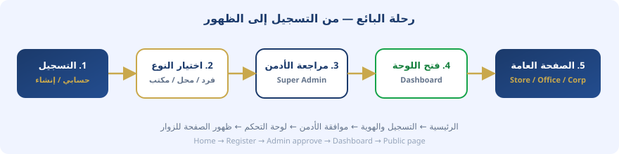
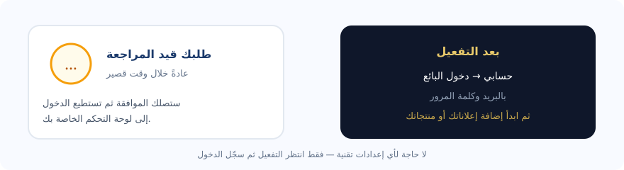
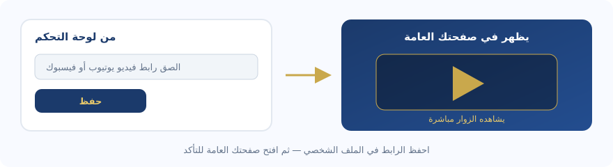

# دليل لوحات التحكم والمستخدم — رزق (داخلي)

**الإصدار:** 1.3 · **سبتمبر 2026** · ADMINIA SARL

> **دليل الزوّار العام:** افتح [`rizq_help.html`](../../rizq_help.html) — HTML واضح بدون تفاصيل تقنية.  
> **هذا الملف داخلي** لفريق الأدمن؛ لا يُربَط من واجهة الزوّار.

هذا الملف يشرح للفريق: التسجيل، الموافقة، الدخول، أنواع اللوحات، الفيديو التعريفي، ونشر الإعلان.

---

## 1) رحلة البائع باختصار

1. افتح الصفحة الرئيسية واختر **حسابي → إنشاء حساب**.
2. اختر النوع: **فرد / محل / مكتب / شركة**.
3. املأ البيانات وارفع الهوية عند الطلب، ثم أرسل.
4. ينتظر الحساب موافقة الأدمن في تبويب **الحسابات** (pending).
5. بعد الموافقة يظهر في **المستخدمون** ويمكن فتح لوحة التحكم بالرابط الآمن.
6. من اللوحة: أضف منتجات/إعلانات/خدمات، ثم تظهر في الصفحة العامة.

**ماذا يحدث خلف الكواليس؟** الطلب يُحفظ على الخادم بحالة `pending`. الأدمن يراجع الهوية. عند الموافقة تتغيّر الحالة إلى `approved` ويُفتح مسار لوحة التحكم المناسب لنوع الحساب.

---

## 2) أين يرى الأدمن طلبك؟

| التبويب في Super Admin | ماذا يظهر؟ |
|------------------------|------------|
| **الحسابات** | طلبات جديدة بانتظار الموافقة أو الرفض (`pending`) |
| **المستخدمون** | الحسابات المعتمدة فقط (`approved`) |

- لا يظهر الحساب المعتمد في «الحسابات»؛ انتقل إلى «المستخدمون» لمتابعته.
- إذا سجّل مستخدم للتو ولم يظهر للأدمن: تأكد أن الأدمن يفتح **الحسابات** وليس **المستخدمون**.

---

## 3) تسجيل الدخول مرة أخرى (بعد الموافقة)

1. من الرئيسية: **حسابي → دخول البائع**.
2. أدخل البريد وكلمة المرور المسجَّلين عند الإنشاء.
3. يتم التحقق عبر الخادم (`/api/accounts/seller-login`) — وليس من الجهاز فقط.
4. تُفتح اللوحة المناسبة تلقائياً حسب نوع الحساب (فرد / محل / مكتب / شركة).
5. إذا كان الحساب معلّقاً أو غير موافق عليه، لن تُفتح اللوحة؛ راجع حالة الحساب مع الأدمن.

---

## 4) الفيديو التعريفي

1. لوحة التحكم → **الملف الشخصي**.
2. الصق رابط **YouTube** أو **Facebook**.
3. اضغط **حفظ التغييرات** (يُزامَن مع الخادم).
4. افتح صفحتك العامة وتأكد من ظهور المشغّل.

**نصيحة:** استخدم رابطاً عاماً (قابل للمشاهدة بدون تسجيل دخول خاص)، ثم حدّث الصفحة العامة بعد الحفظ.

---

## 5) أنواع اللوحات

| النوع | ملف اللوحة | الاستخدام | الصفحة العامة |
|------|------------|-----------|----------------|
| أفراد | `rizq_dashboard.html` | إعلانات شخصية | صفحة الملف / الإعلان |
| محل | `rizq_dashboard_store.html` | منتجات ومتجر | `rizq_store.html` |
| مكتب | `rizq_dashboard_office.html` | خدمات مكتبية | `rizq_office.html` |
| شركة / معرض | `rizq_dashboard_corp.html` | كتالوج شركات | `rizq_corp.html` |

كل نوع له اشتراك وحدود (عدد المنتجات/الإعلانات، الشارات، الأولوية). راجع مصفوفة الباقات في الكتيب الشامل.

---

## 6) نشر إعلان (الأفراد)

1. من اللوحة أو زر **انشر إعلان**.
2. اختر القسم والفرع، املأ العنوان والوصف والسعر، وأضف صوراً واضحة.
3. لقسم **الخدمات**: لا حاجة لحالة المنتج ولا الكمية — الحقول تُخفى تلقائياً.
4. يمكنك تفعيل: **قابل للتفاوض** / **عاجل** / **إخفاء الهاتف**.
5. الإعلان يبدأ بحالة مراجعة حتى يوافق الأدمن، ثم يظهر في التصفح للجمهور.

---

## 7) المحل والمكتب والشركة — ماذا تفعل بعد الدخول؟

### محل
- أضف منتجات مع صور وأسعار.
- حدّث بيانات المتجر (الاسم، الوصف، الهاتف، العنوان).
- راجع الطلبات إن كانت مفعّلة في باقتك.

### مكتب
- أضف الخدمات المهنية والوصف.
- اضبط ساعات العمل ووسائل التواصل.
- فعّل الفيديو التعريفي إن رغبت.

### شركة / معرض
- ابنِ الكتالوج أو المعرض.
- استخدم أدوات التمييز (VIP / أولوية) إن كانت ضمن الاشتراك.
- راجع الظهور في الصفحة العامة بعد كل حفظ.

---

## 8) مشاكل شائعة وحلول سريعة

| المشكلة | الحل |
|---------|------|
| الحساب لا يظهر للأدمن | افتح تبويب **الحسابات** (pending) وليس المستخدمون |
| لا أستطيع الدخول | تأكد من الموافقة، ثم البريد/كلمة المرور الصحيحة |
| الصفحة العامة فارغة | أضف محتوى من اللوحة واحفظ؛ انتظر مراجعة الإعلانات إن لزم |
| الفيديو لا يظهر | تحقق من الرابط ثم «حفظ التغييرات» وحدّث الصفحة العامة |
| تنزيل الدليل فشل | من `rizq_help.html` استخدم «رابط مباشر» أو `/api/help-guide/...` مع تشغيل الخادم |

---

## 9) تنزيل الأدلة

| الدليل | لمن؟ | المسار |
|--------|------|--------|
| دليل الزوّار (HTML) | عام | `rizq_help.html` |
| دليل اللوحات (هذا الملف) | أدمن/فريق فقط | عبر API بمصادقة أدمن |
| الكتيب الشامل | أدمن/فريق فقط | عبر API بمصادقة أدمن |

الصور التوضيحية العامة: مجلد `/help-images/`.
